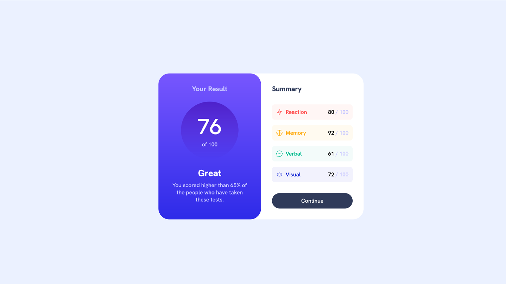
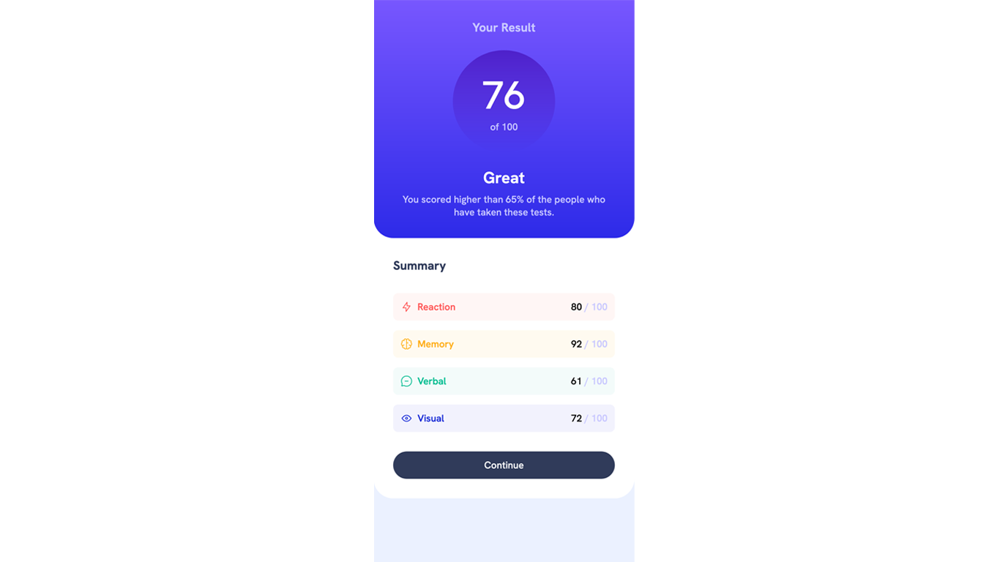

# Frontend Mentor - Results summary component solution

This is a solution to the [Results summary component challenge on Frontend Mentor](https://www.frontendmentor.io/challenges/results-summary-component-CE_K6s0maV). Frontend Mentor challenges help you improve your coding skills by building realistic projects.

## Table of contents

- [Links](#links)
- [The challenge](#the-challenge)
- [Screenshot](#screenshot)
- [My process](#my-process)
- [Built with](#built-with)
- [Author](#author)

### Links

- Solution URL: [https://www.frontendmentor.io/solutions/results-summary-component-css-grid-and-flexbox-dxze9QO-k\_](https://www.frontendmentor.io/solutions/results-summary-component-css-grid-and-flexbox-dxze9QO-k_)
- Live Site URL: [https://user9511.github.io/frontend-mentor-results-summary-component-main/](https://user9511.github.io/frontend-mentor-results-summary-component-main/)

### The challenge

Users should be able to:

- View the optimal layout for the interface depending on their device's screen size
- See hover and focus states for all interactive elements on the page

### Screenshot

## My process

### Built with

- Semantic HTML5 markup
- CSS custom properties
- Flexbox
- CSS Grid
- Mobile-first workflow

**Note: These are just examples. Delete this note and replace the list above with your own choices**

## Author

- Website - [shanemcgeown](https://www.linkedin.com/in/shanemcgeown/)
- Frontend Mentor - [@User9511](https://www.frontendmentor.io/profile/User9511)
